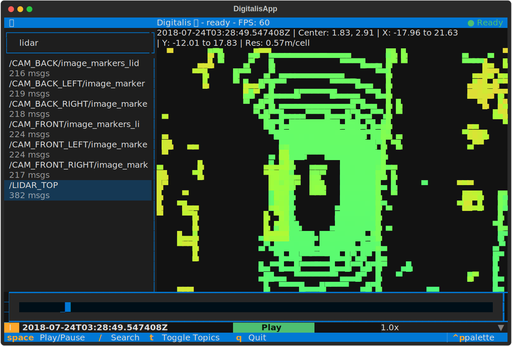

# Robotic Tools

## Digitalis

Digitalis is a visualization tool for robotics development in your terminal.

```sh
uvx --from "git+https://github.com/mrkbac/robotic-tools.git#subdirectory=digitalis" digitalis
```



## mcap-ros2-support-fast

`mcap-ros2-support-fast` is a python only, high-performance implementation ROS2 message serialization and deserialization.

## pymcap-cli

```sh
uvx --from "git+https://github.com/mrkbac/robotic-tools.git#subdirectory=pymcap-cli" pymcap-cli
```

`pymcap-cli` is pure python a command-line interface for working with MCAP files.

## fox-bridge

```sh
uvx --from "git+https://github.com/mrkbac/robotic-tools.git#subdirectory=fox-bridge" fox-bridge
```

`fox-bridge` is a simple proxy of [Foxglove Bridge](https://github.com/foxglove/foxglove-sdk/tree/main/ros/src/foxglove_bridge) which converts messages just in time and forwards via Foxglove Bridge compatible protocol.

## License

All tools in this repo are licensed under MIT.

These tools draw inspiration from the following projects (mostly MIT licensed):

- <https://github.com/foxglove/mcap>
- <https://github.com/foxglove/ros-typescript>
