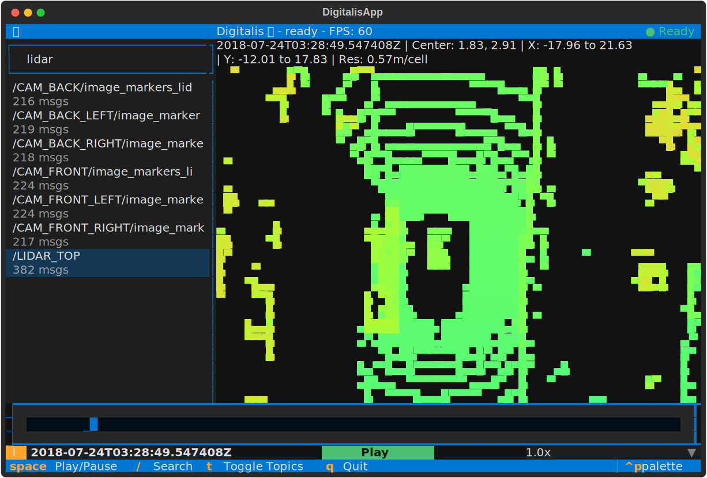

# Robotic Tools

A collection of Python tools for working with robotics data, MCAP files, and ROS messages.

## Packages

### Digitalis

Terminal-based visualization tool for robotics development. Supports MCAP files and WebSocket streams.

```sh
uvx digitalis recording.mcap
```



### pymcap-cli

A pure Python CLI for processing MCAP files with recovery, filtering, and compression.

```sh
uvx pymcap-cli info data.mcap
```

### small-mcap

Lightweight Python library for reading and writing MCAP files. Zero dependencies, high performance.

```sh
uv add small-mcap
```

### mcap-ros2-support-fast

High-performance pure Python ROS2 message serialization and deserialization. 30-60x faster than the reference implementation.

```sh
uv add mcap-ros2-support-fast
```

### ros-parser

Parser for ROS1 and ROS2 message definitions and Foxglove message path syntax.

```sh
uv add ros-parser
```

### websocket-bridge

Python library implementing the Foxglove WebSocket protocol for streaming robotics data.

```sh
uv add websocket-bridge
```

### websocket-proxy

Proxy for [Foxglove Bridge](https://github.com/foxglove/foxglove-sdk/tree/main/ros/src/foxglove_bridge) with just-in-time message conversion, image compression, and point cloud compression.

```sh
uvx --from websocket-proxy bridge ws://localhost:8765
```

## License

These tools draw inspiration from the following projects (mostly MIT licensed):

- <https://github.com/foxglove/mcap>
- <https://github.com/foxglove/ros-typescript>
