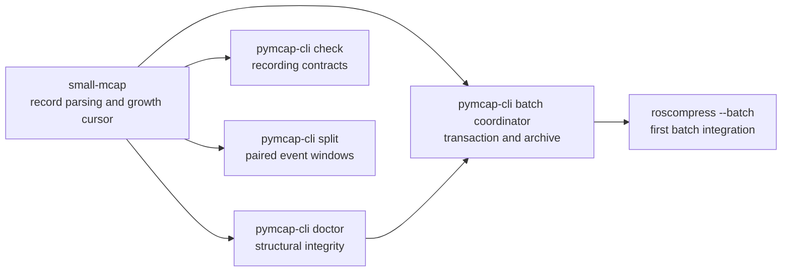

# MCAP reliability features: implementation sketch

Status: design sketch, not an accepted compatibility contract.

This document covers five related additions:

1. bounded-memory, machine-readable `doctor`;
2. multi-clock and cross-topic pipeline contracts in `check`;
3. transactional batch `roscompress`;
4. a true growing-file follower in `small-mcap`;
5. paired event windows in `split`.

The common theme is reliable operation on large or active MCAP recordings. The
features should share small primitives where that is useful, but they should not
be hidden behind one large framework.

## Package ownership



- `small-mcap` owns record boundaries, complete-tail detection, and resumable
  reading state. It does not own polling policy, CLI output, or ROS semantics.
- `pymcap-cli doctor` owns structural MCAP validation and stable finding codes.
- `pymcap-cli check` owns declarative recording and pipeline contracts.
- A reusable `pymcap-cli` coordinator owns batch discovery, transactions, and
  archive state. `roscompress --batch` is its first consumer; `process --batch`
  can reuse it later.
- `split` owns event-window file production. It should reuse MessagePath and the
  existing output-router machinery.

## 1. Bounded-memory, machine-readable `doctor`

### User interface

```bash
pymcap-cli doctor recording.mcap
pymcap-cli doctor recording.mcap --format jsonl
```

`text` remains the default. `jsonl` is the stable machine interface:

```json
{"schema_version":1,"type":"finding","code":"CHUNK_CRC_MISMATCH","severity":"error","offset":1234,"section":"data","record":"Chunk","message":"..."}
{"schema_version":1,"type":"summary","path":"recording.mcap","records":1200,"messages":9000,"chunks":30,"errors":1,"warnings":0,"complete":true}
```

Requirements:

- Define the record union in a new
  `pymcap-cli/schemas/mcap_doctor_report.json`; treat it as the output source of
  truth.
- Preserve the current exit-code behavior and existing finding codes.
- Emit findings as they are finalized; do not retain them all for JSONL.
- Always emit one final summary record after a completed scan.
- A parse failure should be a normal finding plus a summary, not a Python
  traceback in machine mode.
- Keep terminal formatting outside the validation engine.

### Internal shape

Replace `McapDoctor.frames` with a streaming validator and explicit evidence
sinks:

```python
class FindingSink(Protocol):
    def emit(self, finding: Finding) -> None: ...


class DoctorEvidenceStore(Protocol):
    def append_chunk(self, evidence: ChunkEvidence) -> None: ...
    def next_chunk(self) -> ChunkEvidence | None: ...
```

The scan has three bounded states:

1. Global aggregates: definitions, counts, section offsets, CRC state, and a
   bounded set of failure samples.
2. Current-record/current-chunk state. Message-index entries are checked against
   the immediately preceding chunk and then discarded.
3. Compact cross-section evidence. Chunk facts needed by later `ChunkIndex`
   records are written to a temporary binary spool instead of retained in RAM.

Attachments and other large opaque payloads must be CRC-checked in blocks. A
whole attachment must never be materialized merely for `doctor`. Chunks may
require one compressed and one decompressed buffer, so the documented memory
bound is:

```text
O(unique schemas + unique channels + largest compressed chunk
  + largest decompressed chunk + configured finding samples)
```

The temporary evidence spool is proportional to chunks and per-chunk channel
indexes, not messages or payload bytes. It is removed on normal completion and
on exceptions.

### Implementation slices

1. Introduce `FindingSink`; make the existing implementation emit through it
   without changing validation behavior.
2. Add the JSONL sink and golden schema/exit-code tests.
3. Replace the global frame list one validation family at a time with aggregates,
   current-chunk state, and the evidence spool.
4. Delete the old retained-frame path only after finding-code parity tests pass.

### Acceptance

- Existing doctor fixtures produce the same finding codes and severities.
- JSONL parses one object per line and ends with exactly one summary.
- A synthetic recording with increasing message and chunk counts has bounded
  resident state; memory must not scale with message count.
- Large attachments are validated with bounded reads.
- Truncation, malformed record lengths, CRC failures, bad indexes, and invalid
  summaries retain precise offsets.

## 2. Multi-clock and cross-topic contracts in `check`

### Schema version

Keep version 1 behavior unchanged. Add version 2 to
`pymcap-cli/schemas/mcap_check_spec.json`; regenerate the Python types through
the existing pre-commit generator.

Version 2 adds a reusable time source:

```yaml
source: log       # log | publish | message
path: .header.stamp  # required only for message
```

A message value is accepted as nanoseconds when it is:

- an integer;
- a ROS-like `{sec, nanosec}` value;
- an object with `sec` and `nanosec` fields.

Invalid, missing, or non-integral time values are contract failures. They are
not silently replaced by log time.

### Per-topic clocks

```yaml
version: 2
topics:
  camera:
    topic: /camera/image
    clock:
      source: message
      path: .header.stamp
    frequency:
      min: 9.5
      max: 10.5
      window: 5s
    timeout: 250ms
    monotonic: true
```

- `frequency`, `timeout`, and `monotonic` use the selected topic clock.
- Default remains log time.
- Results state the clock used.
- Non-monotonic clocks fail explicitly; the evaluator does not sort them and
  hide the defect.

### Pipeline contracts

The first version deliberately supports one input topic rule and one output
topic rule per pipeline. That covers the observed input/output cardinality and
latency checks without prematurely designing arbitrary joins.

```yaml
pipelines:
  lidar_to_objects:
    input: lidar
    output: objects
    match:
      input:
        source: message
        path: .header.stamp
      output:
        source: message
        path: .header.stamp
      max_lateness: 500ms
      max_pending: 10000
    outputs_per_input:
      min: 1
      max: 1
    inputs_per_output:
      max: 1
    latency:
      from: {side: input, source: publish}
      to: {side: output, source: publish}
      max: 50ms
    grace:
      start: 1s
      end: 1s
```

MVP matching uses exact keys. Approximate/tolerance matching is deferred because
its cardinality semantics are ambiguous.

The evaluator maintains keyed pending groups and a watermark. Keys older than
`largest_seen_key - max_lateness` are finalized. `max_lateness` and
`max_pending` are required so malformed or adversarial files cannot cause
unbounded memory. `max_pending` counts messages, not only unique keys, so one
repeated key is also bounded. Exceeding it is a contract error, not eviction.

For every finalized key it checks:

- outputs per input;
- inputs per output;
- selected-clock latency;
- missing counterparts.

For a key with `N` inputs and `M` outputs, an outputs-per-input range requires
`N * min <= M <= N * max`; an inputs-per-output maximum requires
`N <= M * max`. Latency is the maximum output `to` clock minus the earliest
input `from` clock for that key. A message arriving after its key's watermark
was finalized is an explicit lateness failure.

Start/end grace excludes incomplete boundary keys from cardinality results. As
with value rules, failure examples remain bounded.

### Code shape

- `TimeSource` and `TimeSourceEvaluator` handle MCAP header clocks and decoded
  MessagePath clocks.
- `_RateTracker` receives evaluated timestamps; it does not know their source.
- `PipelineTracker` owns watermarks, pending groups, cardinality, and latency.
- The existing scan decodes a message at most once even when value, clock, and
  pipeline rules all need the payload.
- File and live-bridge evaluators share the same topic clock logic. Pipeline
  rules are file-only initially; live pipeline watermarks are a separate change.

### Acceptance

- Version 1 specs and output remain unchanged.
- Frequency/timeout/monotonic tests cover log, publish, and ROS header clocks.
- Pipeline tests cover 1:1, fan-out, fan-in rejection, missing messages, excess
  latency, out-of-order keys within lateness, grace, and pending-limit failure.
- Decode-count tests prove one payload decode per message.
- State-size tests prove pending memory is bounded by the configured limit.

## 3. Transactional batch `roscompress`

### CLI decision

Use a flag, not a new command group, so all existing compression options remain
defined once:

```bash
pymcap-cli roscompress INPUT_DIR \
  --batch \
  --output-dir OUTPUT_DIR \
  [--archive ARCHIVE.jsonl] \
  [--continue-on-error] \
  [--force] \
  [ROSCOMPRESS OPTIONS...]
```

`--batch` requires one local directory and `--output-dir`. It rejects positional
single-file output, URLs, `--delete-source`, and any future multi-output mode.
Discovery is recursive, sorted by relative path, and excludes the resolved
output tree and coordinator partials. Batch mode never prompts.

The coordinator is reusable infrastructure, but only `roscompress --batch` is
in the first release. A later `process --batch` supplies a different transform
factory to the same coordinator.

### Shared coordinator

```python
class BatchTransform(Protocol):
    def recipe(self) -> JsonValue: ...
    def preflight(self, source: Path) -> None: ...
    def run(self, source: Path, partial: Path) -> TransformResult: ...
    def validate(self, source: Path, partial: Path, result: TransformResult) -> None: ...
```

`recipe()` contains every output-affecting option, recipe-schema version,
`pymcap-cli` version, and resolved backend/encoder choice. Operational flags,
paths, logging, and `--continue-on-error` are excluded.

### Archive

Default: `OUTPUT_DIR/.pymcap-roscompress-archive.jsonl`.

```json
{
  "schema_version": 1,
  "recipe": "sha256:...",
  "source": {
    "relative_path": "day/run.mcap",
    "size": 85083433700,
    "fingerprint": "xxh3_128:..."
  },
  "output": {
    "relative_path": "day/run.mcap",
    "size": 14204649448,
    "sha256": "..."
  }
}
```

The bounded source fingerprint is an operational identity, not a cryptographic
proof. A resume skip requires matching recipe and source identity plus the exact
output path, size, SHA-256, and a successful bounded-memory doctor scan. Compute
the digest while doctor makes its sequential validation pass, rather than read
the output twice. Missing, malformed, legacy, or mismatched entries never
authorize a skip.

Full output SHA-256 is intentionally the safe default for batch `roscompress`.
An explicitly named future fast-resume mode may use a bounded output fingerprint,
but its weaker guarantee must be visible and must never downgrade an existing
SHA-backed entry.

### Per-job transaction

1. Map the source relative path to its final output. Reject equality, hard-link
   aliases, output-tree recursion, and duplicate mappings.
2. Acquire a host-local advisory lock keyed by canonical output path.
3. Capture source device, inode, size, mtime, and ctime; calculate its bounded
   fingerprint.
4. Under a short archive lock, check the latest valid record for source plus
   recipe. Authenticate the output before returning `verified-resumed`.
5. Otherwise, an existing final output is a collision unless `--force`.
6. Run source structural preflight through the in-process doctor API. Encoder
   and optional-backend checks occur before creating output.
7. Check parent writability and conservative free space for one new output.
8. Write exactly once to a unique hidden sibling partial:

   ```text
   .run.mcap.pymcap-partial.<pid>.<random>
   ```

9. Require processor completion without reported errors. Validate the partial
   with bounded-memory doctor and calculate its SHA-256 in that same sequential
   pass. Transform-specific semantic comparison is a `BatchTransform.validate`
   hook; it is not hard-coded into the coordinator.
10. Recheck the complete source stat identity. A change deletes only the owned
    partial and fails the job.
11. Flush and fsync the partial, then atomically rename/replace it onto the final
    path. With `--force`, the old output remains intact until this point.
12. Fsync the parent directory.
13. Append the previously calculated digest in the success record while holding
    the archive lock, flush, and fsync the archive.

SIGINT or an exception removes only the exact partial owned by the invocation
and never archives the incomplete job. Jobs are sequential. Stop on first error
unless `--continue-on-error` is supplied.

Report per-file `created`, `verified-resumed`, or `failed`, followed by counts,
input/output bytes, bytes saved, elapsed time, and newly processed throughput.

### Migration boundary

The batch transaction guarantees publication and resume integrity. Proving that
specific untransformed topics remain byte-identical is a transform policy, not a
batch primitive. The hook above allows a generic retained-topic verifier later;
until it exists, a deployment that depends on radar-specific equality must keep
its existing semantic regression check.

### Acceptance

- Recursive deterministic mapping and output-tree exclusion, including symlinks.
- Verified resume and recipe mismatch.
- Deleted, truncated, replaced, corrupt, or wrong-digest output never skips.
- Existing unarchived output fails without `--force`.
- Source changes during processing prevent publication and archive update.
- Failure and Ctrl-C remove only the owned partial.
- `--force` preserves the old output until atomic replacement.
- Competing output locks prevent duplicate work; archive locking prevents lost
  appends.
- Stop-first and `--continue-on-error` summaries and exit codes.

## 4. A true growing-file follower in `small-mcap`

### API

The core API is non-blocking so a library caller controls timers and shutdown:

```python
with McapFollower.open(path) as follower:
    batch = follower.poll_messages(max_messages=1000, max_bytes=16 * 1024 * 1024)
    for message in batch.messages:
        consume(message)
    if batch.is_final:
        break
```

```python
@dataclass(frozen=True, slots=True)
class FollowBatch:
    messages: tuple[MessageTuple, ...]
    committed_offset: int
    is_final: bool
```

A poll always has finite message and byte budgets. One individual message may
exceed the byte budget, so progress remains possible and the memory bound still
includes the largest completed record. A convenience
`iter_messages(poll_interval=..., idle_timeout=...)` may sleep and poll, but it
is layered on `poll_messages()`.

### Cursor semantics

- Save the offset before every record header.
- A complete header plus complete body commits the new offset.
- A partial header/body restores the previous committed offset and returns an
  empty or shorter batch. Parser and data-section CRC state roll back with the
  offset. A partial record is not an error and is never emitted twice.
- A chunk becomes visible only when the entire chunk record exists and its
  requested CRC validates. MessageIndex records are not required before emitting
  the complete chunk's messages.
- Persist schema/channel definitions and decoder state across polls.
- Footer plus trailing magic marks `is_final=True`.

This requires a reusable transactional `try_read_record()` primitive. The
existing `allow_incomplete=True` iterator cannot be resumed safely because a
short body read may leave the stream positioned inside the incomplete record.

### Replacement and truncation

Track device, inode, and size at every poll:

- size below `committed_offset` raises `McapFileTruncatedError`;
- device/inode replacement raises `McapFileReplacedError`;
- replacement is never silently reopened because that would silently duplicate
  messages;
- an explicit `reopen_on_replace` convenience policy may return a reset event in
  a later release.

The follower supports append-only local regular files. Reverse reads, HTTP,
parallel decompression, and following a rewritten file are initially out of
scope.

### Acceptance

- Append one byte at a time across magic, headers, bodies, compressed chunks,
  indexes, footer, and trailing magic; emit every message exactly once.
- Repeated polls without growth return no messages and do not move the cursor.
- A complete chunk followed by a partial MessageIndex still emits the chunk once.
- CRC failure appears only after the relevant complete record exists.
- Truncation and inode replacement raise distinct typed errors.
- Memory is bounded by persistent definitions, configured poll budgets, and the
  largest completed record or decompressed chunk.

## 5. Paired event windows

### CLI

Extend `split` rather than add another top-level command:

```bash
pymcap-cli split input.mcap \
  --window-start '/events/start{data==true}' \
  --window-end '/events/stop{data==true}' \
  --min-window 1s \
  --max-window 10m \
  --unclosed-window error \
  --orphan-stop error \
  --nested-start error \
  --output-template 'window_{index:03d}.mcap'
```

Both expressions use the existing absolute MessagePath syntax. A filter matches
when its result is non-empty; a primitive expression matches when it evaluates
to `true`. Other return types are rejected.

Default policies are explicit and conservative:

- orphan stop: `error`;
- nested start: `error`;
- unclosed start at EOF: `error`;
- window outside min/max duration: `error`.

Optional policies may be `ignore`/`drop` where doing so is intentional. Values
are never silently clamped or paired differently.

### Discovery and router state machines

Paired windows use two passes over an unchanged local file:

1. A discovery pass reads only the event channels, pairs and validates every
   boundary, and produces static `OutputSegmentInfo` entries.
2. The normal processing pass re-evaluates those event messages and routes all
   messages into the already validated segments.

Capture source stat identity before discovery, before processing, and after
processing. A change aborts and removes only outputs owned by this invocation.
Local seekable files are the first-release boundary; HTTP would need a stable
remote identity contract across both passes.

Add `PairedEventWindowProcessor(OutputRouter)` with states `OUTSIDE` and
`INSIDE(index, start_time)`:

```text
OUTSIDE --start--> INSIDE
INSIDE  --stop---> OUTSIDE and finalize segment
```

- Messages outside a window route nowhere.
- Messages from the matching start through matching stop route to the current
  window, including both boundary messages by default.
- Messages with equal log times retain MCAP file order for deterministic
  start/stop handling.
- A chunk containing either event channel decodes. A chunk with neither event
  channel can fast-copy to the current window or skip while outside.
- The discovery pass makes output keys and time bounds static. Template fields
  can therefore include `window_start` and `window_end` before any output opens.
- Min/max duration and malformed-pair policies are resolved before the output
  pass. A `drop` policy is safe because a dropped segment is never opened.
- The output pass must observe the same boundary sequence as discovery; a
  mismatch is a source-change error even if filesystem timestamps were spoofed.

### Acceptance

- Multiple disjoint windows and no outside messages.
- Separate start/stop topics and same-topic expressions.
- Same-timestamp deterministic ordering.
- Orphan stop, nested start, unclosed EOF, and duration policies.
- Boundary message inclusion.
- Chunk fast-copy while inside and chunk skip while outside.
- Missing decoder/schema and MessagePath evaluation failures are surfaced.
- Output schema/channel registration and payload decoding remain valid.

## Delivery order

Each numbered item should be a reviewable PR with behavior tests in the same
change:

1. Doctor finding sink plus JSONL output.
2. Bounded doctor state and evidence spool.
3. Check version 2 time sources and per-topic clocks.
4. Bounded cross-topic pipeline tracker.
5. Reusable batch coordinator plus `roscompress --batch`.
6. Transactional record cursor plus `McapFollower` in `small-mcap`.
7. Paired event-window router and CLI.

Doctor precedes batch because batch preflight and resume authentication should
call the in-process bounded validator. Check clocks precede pipeline rules so
there is only one clock extraction model. The follower and event-window work are
otherwise independent.

Before removing any Sensmore-side workaround, rerun its large-recording and
semantic regression matrix against the corresponding released wheel. Package
tests prove library behavior; they do not by themselves prove live recorder,
filesystem, encoder, or deployment behavior.

## Explicit non-goals

- Moving Sensmore's `PktDf`, ROS-native reader, TF buffer, or simulation runner
  into these libraries.
- Adding ROS runtime dependencies to `small-mcap` or
  `mcap-ros2-support-fast`.
- Batch parallelism, HTTP batch inputs, source deletion, or batch watch mode in
  the first release.
- Approximate pipeline joins or arbitrary multi-topic query graphs.
- Silently reopening replaced growing files.
- Silently repairing, clamping, or pairing malformed event sequences.
