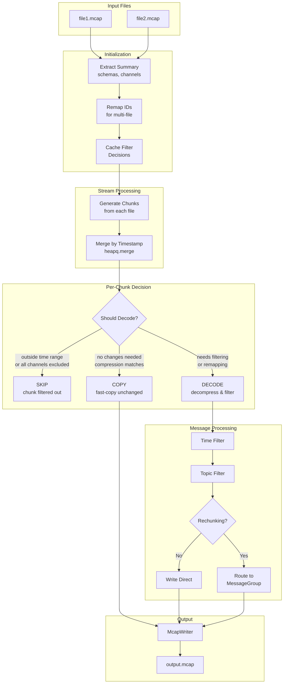

# MCAP Processor

The `McapProcessor` is a unified processor for MCAP files that handles recovery, filtering, merging, and rechunking through a single processing pipeline.

## Key Components

| Component           | Description                                                               |
| ------------------- | ------------------------------------------------------------------------- |
| `InputOptions`      | Per-input file configuration: stream, time/topic filtering, content flags |
| `OutputOptions`     | Output configuration: compression, chunk size, rechunking strategy        |
| `ProcessingOptions` | Combines list of `InputOptions` with single `OutputOptions`               |
| `ProcessingStats`   | Tracks input/output message counts, chunks processed, and errors          |
| `Remapper`          | Handles ID remapping when merging multiple files                          |
| `MessageGroup`      | Manages independent chunk groups for rechunking by topic pattern          |

## Processing Flow

## Processing Paths

### SKIP

Chunk is discarded entirely when:

- All messages fall outside the time range
- All channels in the chunk are excluded by topic filters

### COPY (Fast Path)

Chunk is appended directly without decoding when:

- No time filtering required within the chunk
- No channel ID remapping needed
- Output compression matches chunk compression
- All channels pass topic filters

### DECODE

Chunk must be decompressed and messages processed individually when:

- Time filtering needs per-message evaluation
- Channel IDs were remapped (multi-file merge)
- Compression format differs from output
- Mixed included/excluded channels in chunk
- Rechunking is active

## Multi-File Merging

When processing multiple files:

1. Each file's schemas and channels are remapped to avoid ID conflicts
2. Chunks from all files are merged chronologically using `heapq.merge()`
3. Messages maintain global timestamp ordering in the output
