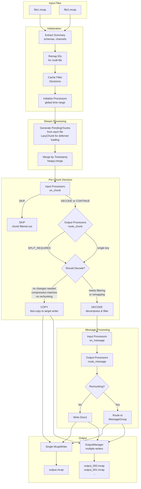

# MCAP Processor

The `McapProcessor` is a unified processor for MCAP files that handles recovery, filtering, merging, splitting, and rechunking through a single processing pipeline.

## Key Components

| Component           | Description                                                                    |
| ------------------- | ------------------------------------------------------------------------------ |
| `InputOptions`      | Per-input file configuration: stream, time/topic filtering, content flags      |
| `OutputOptions`     | Output configuration: compression, chunk size, rechunking, split processors    |
| `ProcessingOptions` | Combines list of `InputOptions` with single `OutputOptions`                    |
| `ProcessingStats`   | Tracks input/output message counts, chunks processed, and errors               |
| `Remapper`          | Handles ID remapping when merging multiple files                               |
| `MessageGroup`      | Manages independent chunk groups for rechunking by topic pattern               |
| `PendingChunk`      | Chunk wrapper with timestamp ordering for `heapq.merge` (lazy chunk loading)   |
| `Processor`         | Base class for composable filter/routing pipeline (see [Processor Pipeline])   |
| `ChunkDecision`     | Enum: CONTINUE / SKIP / DECODE (drives the three processing paths)             |
| `Action`            | IntFlag: CONTINUE / SKIP / KEEP (per-message/channel filter result)            |
| `OutputManager`     | Manages multiple writers for multi-output splitting                            |
| `OutputSegment`     | One output file in a multi-output split, with its own writer and tracking      |

[Processor Pipeline]: #processor-pipeline

## Processor Pipeline

The processing pipeline is built from composable `Processor` instances. Each processor can influence chunk-level decisions, filter messages/channels, and route output.

### Base Methods

| Method             | Returns                     | Purpose                                            |
| ------------------ | --------------------------- | -------------------------------------------------- |
| `on_chunk()`       | `ChunkDecision`             | Chunk-level decision: SKIP, DECODE, or CONTINUE    |
| `on_channel()`     | `Action`                    | Channel inclusion/exclusion                        |
| `on_message()`     | `Action`                    | Per-message filtering                              |
| `on_metadata()`    | `Action`                    | Metadata record filtering                          |
| `on_attachment()`  | `Action`                    | Attachment record filtering                        |
| `initialize()`     | `None`                      | Called with summaries from all inputs before processing |
| `route_chunk()`    | `int \| str \| None`        | Output key for chunk, or `SPLIT_REQUIRED` sentinel  |
| `route_message()`  | `int \| str \| None`        | Output key for message                             |
| `output_keys()`    | `list[int \| str] \| None`  | All possible output keys, or `None` if dynamic     |

### Built-in Processors

**Input processors** (in `InputOptions`):

| Processor                  | Purpose                                                  |
| -------------------------- | -------------------------------------------------------- |
| `TopicFilterProcessor`     | Regex include/exclude on channel topics                  |
| `TimeFilterProcessor`      | Time range filtering with chunk-level skip/decode        |
| `MetadataFilterProcessor`  | Include/exclude all metadata records                     |
| `AttachmentFilterProcessor`| Include/exclude all attachment records                   |
| `AlwaysDecodeProcessor`    | Force chunk decoding (recovery mode)                     |

**Output processors** (in `OutputOptions`):

| Processor                   | Purpose                                                 |
| --------------------------- | ------------------------------------------------------- |
| `DurationSplitProcessor`   | Split every N nanoseconds, preserves COPY fast-path     |
| `TimestampSplitProcessor`  | Split at specific timestamps, preserves COPY fast-path  |
| `ExpressionSplitProcessor` | Split by arbitrary callable, always decodes             |

## Processing Flow


```mermaid
flowchart TD
    subgraph Input["Input Files"]
        F1[file1.mcap]
        F2[file2.mcap]
    end

    subgraph Init["Initialization"]
        SUM[Extract Summary<br/>schemas, channels]
        REMAP[Remap IDs<br/>for multi-file]
        CACHE[Cache Filter<br/>Decisions]
        PINIT[Initialize Processors<br/>global time range]
    end

    subgraph Stream["Stream Processing"]
        GEN[Generate PendingChunks<br/>from each file<br/>LazyChunk for deferred loading]
        MERGE[Merge by Timestamp<br/>heapq.merge]
    end

    subgraph Decision["Per-Chunk Decision"]
        PROC[Input Processors<br/>on_chunk]
        ROUTE{Output Processors<br/>route_chunk}
        DEC{Should Decode?}
        SKIP[SKIP<br/>chunk filtered out]
        COPY[COPY<br/>fast-copy to target writer]
        DECODE[DECODE<br/>decompress & filter]
    end

    subgraph MsgProc["Message Processing"]
        TIME[Input Processors<br/>on_message]
        MROUTE[Output Processors<br/>route_message]
        RECHUNK{Rechunking?}
        DIRECT[Write Direct]
        GROUP[Route to<br/>MessageGroup]
    end

    subgraph Output["Output"]
        SINGLE[Single McapWriter]
        MULTI[OutputManager<br/>multiple writers]
        OUT1[output.mcap]
        OUTN[output_000.mcap<br/>output_001.mcap<br/>...]
    end

    F1 --> SUM
    F2 --> SUM
    SUM --> REMAP
    REMAP --> CACHE
    CACHE --> PINIT
    PINIT --> GEN
    GEN --> MERGE
    MERGE --> PROC

    PROC -->|SKIP| SKIP
    PROC -->|DECODE or CONTINUE| ROUTE
    ROUTE -->|SPLIT_REQUIRED| DEC
    ROUTE -->|single key| DEC
    DEC -->|no changes needed<br/>compression matches<br/>no rechunking| COPY
    DEC -->|needs filtering<br/>or remapping| DECODE

    COPY --> SINGLE
    COPY --> MULTI
    DECODE --> TIME
    TIME --> MROUTE
    MROUTE --> RECHUNK
    RECHUNK -->|No| DIRECT
    RECHUNK -->|Yes| GROUP
    DIRECT --> SINGLE
    DIRECT --> MULTI
    GROUP --> SINGLE
    GROUP --> MULTI
    SINGLE --> OUT1
    MULTI --> OUTN
```

## Processing Paths

### SKIP

Chunk is discarded entirely when:

- All messages fall outside the time range (via `TimeFilterProcessor.on_chunk`)
- All channels in the chunk are excluded by topic filters

### COPY (Fast Path)

Chunk is appended directly without decoding when:

- No time filtering required within the chunk
- No channel ID remapping needed
- Output compression matches chunk compression
- All channels pass topic filters
- Rechunking is NOT active
- Chunk falls entirely within a single output segment (no split boundary)

When splitting is active, the chunk is fast-copied to the target segment's writer identified by `route_chunk()`.

### DECODE

Chunk must be decompressed and messages processed individually when:

- Time filtering needs per-message evaluation
- Channel IDs were remapped (multi-file merge)
- Compression format differs from output
- Mixed included/excluded channels in chunk
- Rechunking is active
- Chunk spans a split boundary (`route_chunk()` returns `SPLIT_REQUIRED`)

## Multi-File Merging

When processing multiple files:

1. Each file's schemas and channels are remapped to avoid ID conflicts
2. Chunks from all files are merged chronologically using `heapq.merge()`
3. `PendingChunk` implements `__lt__` for min-heap ordering by `message_start_time`
4. Messages maintain global timestamp ordering in the output

## Multi-Output Splitting

Splitting is implemented through the **processor pipeline**, making it fully extensible.

### Split Modes

| Mode        | Processor                   | COPY fast-path | Description                             |
| ----------- | --------------------------- | -------------- | --------------------------------------- |
| Duration    | `DurationSplitProcessor`    | Yes            | Split every N nanoseconds               |
| Timestamps  | `TimestampSplitProcessor`   | Yes            | Split at specific nanosecond timestamps |
| Expression  | `ExpressionSplitProcessor`  | No (always decodes) | Split by arbitrary callable        |

### How It Works

1. **Initialization**: `processor.initialize(summaries)` receives all input file summaries (which may be `None` for broken files) and precomputes segment boundaries
2. **Chunk routing**: `route_chunk(chunk)` uses `bisect` to determine which segment a chunk belongs to:
   - Chunk within one segment -> returns segment key (COPY-eligible)
   - Chunk spans boundary -> returns `SPLIT_REQUIRED` (forces DECODE)
3. **Message routing**: `route_message(message)` determines output key per decoded message
4. **Writer management**: `OutputManager` lazily creates writers per segment key

### Segment Boundary Performance

For duration/timestamp splits, boundaries are precomputed. Routing is O(log n) per chunk via bisect. For typical 60s splits with ~1s chunks, only ~1.7% of chunks spanning boundaries need decoding.

### OutputManager

Manages the writer pool for multi-output:

- **Lazy creation**: Writers are created on first write to a segment key
- **Per-segment tracking**: Each `OutputSegment` has its own `written_schemas` and `written_channels` sets
- **Schema/channel duplication**: All segments share the same remapped IDs; schemas and channels are written to each segment independently as needed

### Output Naming

The `output_template` supports Python format syntax:

| Variable          | Description                        |
| ----------------- | ---------------------------------- |
| `{index}`         | Zero-based segment index           |
| `{index1}`        | One-based segment index            |
| `{start_time}`    | Segment start timestamp (ns)       |
| `{start_time_iso}`| Segment start as ISO 8601          |
| `{end_time}`      | Segment end timestamp (ns)         |
| `{key}`           | Expression-based segment key       |

### Interaction with Rechunking

Splitting and rechunking are orthogonal. When both are active, each `OutputSegment` gets its own set of `MessageGroup` instances with independent chunk builders.

## Extensibility: Custom Split Processor

To implement custom splitting logic, subclass `Processor` and override the routing methods:

```python
class MySplitProcessor(Processor):
    def initialize(self, summaries: list[Summary | None]) -> None:
        # Precompute boundaries from summaries (may be None for broken files)
        time_range = global_time_range(summaries)
        if time_range:
            start, end = time_range
            # ... compute boundaries

    def on_chunk(self, chunk, indexes) -> ChunkDecision:
        # Return DECODE if chunk spans a split boundary
        # Return CONTINUE otherwise

    def route_chunk(self, chunk) -> int | str | None:
        # Return output key for the chunk, or SPLIT_REQUIRED

    def route_message(self, message) -> int | str | None:
        # Return output key for individual messages

    def output_keys(self) -> list[int | str] | None:
        # Return all possible keys for pre-creation, or None for lazy
```

Pass the processor via `OutputOptions(processors=[MySplitProcessor(...)])`.
